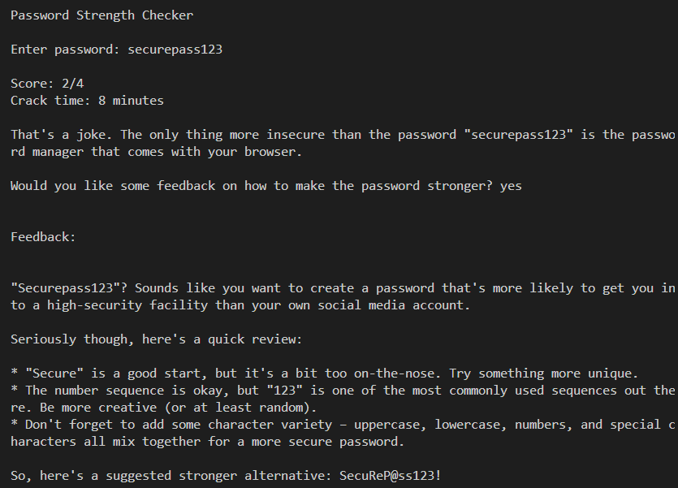

# Password Strength Checker

## A Python script to check the strength of a password 

This is a Python script to check the strength of a password using the zxcvbn library.
The script also uses the llama3.2 LLM to create an AI-generated joke 

## Demo

# Instructions
